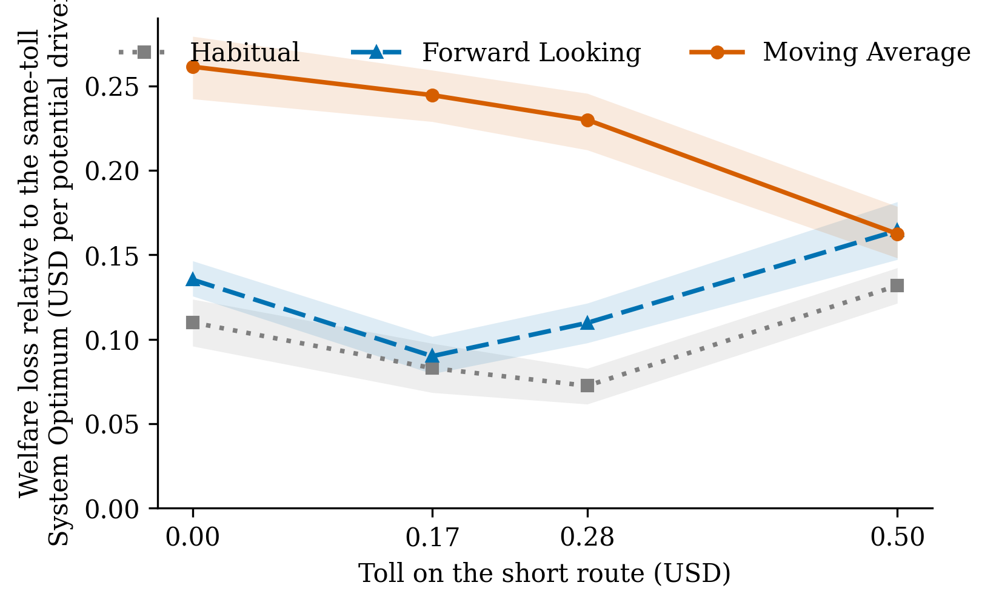

# Evaluating Routing Rules Using Social Welfare

This repository packages an MBA operations-research study and the simulation evidence behind it. It asks a practical question: can route guidance that looks good to an individual driver make the network worse after many drivers respond to the same information?

The study compares three routing rules in a controlled two-route SUMO microsimulation:

- **Moving Average** uses recently observed travel times.
- **Forward Looking** anticipates the conditions drivers are likely to encounter.
- **Habitual** represents non-adaptive, probabilistic route choice.

The evaluation goes beyond prediction accuracy and total travel time. It measures expected and experienced generalized cost, participation, consumer surplus, social welfare, routing regret, toll effects, and mixed adoption.

## What the research found

In the semi-congested numerical setting, Moving Average offered the lowest expected private cost but produced the highest experienced welfare loss after the collective response. Its loss was USD 0.152 more per potential driver than the Habitual rule, approximately USD 303 per commuter-year under the study's illustrative normalization.

Information timing also changed the effect of tolling. Relative to zero toll, the highest tested toll reduced annual welfare loss by approximately USD 204 per commuter-year under Moving Average but increased it by approximately USD 53 under Forward Looking. Mixed populations often performed better than a share-weighted combination of their pure-rule outcomes, but the relationship between adoption and welfare was non-monotonic.

These are results from a defined simulation setting, not universal policy estimates. The transferable contribution is the welfare-based method and the finding that navigation behavior and road pricing should be evaluated jointly.



## Repository map

| Path | Contents |
|---|---|
| [`paper/evaluating-routing-rules-using-social-welfare.pdf`](paper/evaluating-routing-rules-using-social-welfare.pdf) | Complete research paper |
| [`paper/main.tex`](paper/main.tex) | Public LaTeX source with the author's personal ID removed |
| [`paper/references.bib`](paper/references.bib) | Bibliography |
| [`paper/figures/`](paper/figures/) | Figures used in the paper |
| [`results/`](results/) | Aggregate result tables behind the welfare analysis |
| [`simulation/`](simulation/) | Core SUMO model, network, validation runners, tests, and frozen validation outputs |

## Reproduction scope

The included code and outputs expose the model, welfare logic, network specification, and calibration evidence. The multi-gigabyte working simulation database and cloud orchestration are deliberately excluded. Consequently, the aggregate tables and paper can be inspected and the database-independent logic can be tested, while complete raw-data regeneration requires a separately authorized archival-data release.

Run the database-independent validation tests from `simulation/`:

```powershell
python -m pip install -r requirements.txt
python -m pytest tests/test_validation.py tests/test_db_schema.py -q
```

Running the SUMO simulation additionally requires SUMO 1.26.0 and its Python package.

After installing SUMO, its integration test can be run separately:

```powershell
python -m pytest tests/test_stochastic_logit.py -q
```

Build the paper from `paper/` with TeX Live, `latexmk`, and Biber:

```powershell
.\build.ps1
```

## Research integrity and limitations

- The numerical results are specific to a calibrated two-route setting.
- The System Optimum is the best allocation on the tested finite grid; at lower flows its best tested short-route share reaches the upper searched boundary.
- Adaptive rules and comparison conditions do not isolate every possible causal mechanism.
- Environmental, safety, noise, and accident effects are outside the welfare account.

## License

The simulation code is available under the [MIT License](LICENSE). The paper,
figures, and aggregate result tables are available under
[CC BY 4.0](LICENSE-CONTENT.md).

## Citation

Raanan, Yehuda. *Evaluating Routing Rules Using Social Welfare*. MBA research paper, The Hebrew University of Jerusalem, supervised by Professor Nicole Adler.
